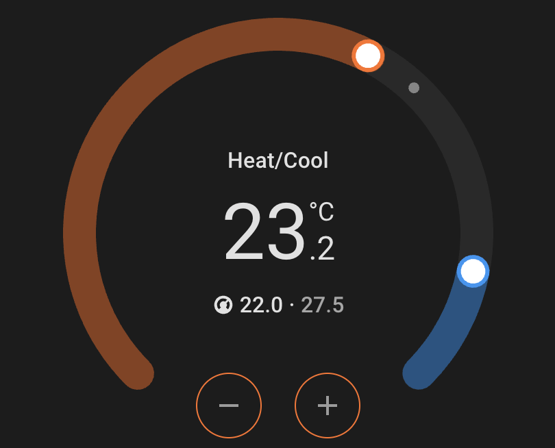

# Two State Thermostat

A Home Assistant Lovelace card for dual-range (heat/cool) climate control with Boost and Maintain operating-state feedback.



## Features

- Dual heating and cooling thermostat range display
- Current control temperature with responsive SVG dial
- Operating state from a dedicated sensor (Off, Idle, Boost/Maintain Heating/Cooling)
- Power button for the virtual climate entity
- Boost button with optional countdown from a timer entity
- Automatic or manual fan control via Home Assistant helpers
- Theme-aware styling using Home Assistant CSS variables
- Graphical Lovelace card editor

This card is **frontend only**. Thermostat logic, timers, hysteresis, and fan staging remain in your Home Assistant configuration.

## Installation

### HACS (recommended)

1. Open **HACS**.
2. Open the three-dot menu → **Custom repositories**.
3. Add repository URL:

   `https://github.com/ryanandrewbaker/two-state-thermostat`

4. Select category: **Dashboard**
5. Click **Add**.
6. Open **HACS → Dashboard** (or search for **Two State Thermostat**).
7. Click **Download**.
8. Reload your browser frontend (or clear cache after updates).
9. Add the card to a dashboard (see [Configuration](#configuration)).

HACS normally registers the resource automatically. If the card does not appear, confirm the resource exists under **Settings → Dashboards → Resources**:

```yaml
url: /hacsfiles/two-state-thermostat/two-state-thermostat.js
type: module
```

### Manual installation

1. Download `two-state-thermostat.js` from the [latest release](https://github.com/ryanandrewbaker/two-state-thermostat/releases/latest).
2. Copy it to your Home Assistant `config/www/` directory.
3. Add a Lovelace resource:

```yaml
url: /local/two-state-thermostat.js
type: module
```

4. Reload your browser frontend.

## Configuration

### Minimal example

Select a virtual climate controller entity. The card discovers companion entities from attributes on that entity (or from conservative naming conventions as a fallback):

```yaml
type: custom:two-state-thermostat
entity: climate.family_room_auto_climate
```

### Legacy example

The card continues to accept the previous explicit configuration format:

```yaml
type: custom:two-state-thermostat
climate_entity: climate.family_room_auto_climate
operating_state_entity: sensor.family_room_auto_operating_state
```

### Full example

```yaml
type: custom:two-state-thermostat
name: Family Room
entity: climate.family_room_auto_climate
temperature_entity: sensor.family_room_control_temperature
operating_state_entity: sensor.family_room_auto_operating_state
fan_auto_entity: input_boolean.family_room_fan_automatic
fan_override_entity: input_select.family_room_fan_override
effective_fan_entity: sensor.family_room_effective_fan_mode
recommended_fan_entity: sensor.family_room_automatic_fan_recommendation
boost_script_entity: script.family_room_climate_boost
boost_cancel_script_entity: script.family_room_climate_cancel_boost
boost_active_entity: input_boolean.family_room_climate_boost
boost_timer_entity: timer.family_room_climate_boost
power_on_mode: heat_cool
target_step: 0.5
show_countdown: true
show_recommended_fan: true
show_effective_targets: false
```

## Package integration contract

The card does **not** control a physical split system directly. It controls a **virtual climate entity** that your Home Assistant package or automation layer owns. That climate entity is the **anchor** for discovery.

### Recommended configuration

```yaml
type: custom:two-state-thermostat
entity: climate.family_room_auto_climate
```

When your package exposes the attributes below on the virtual climate entity, users only need to select the controller in the card editor. Explicit Lovelace YAML always overrides entity attributes.

### Supported climate attributes

| Attribute                    | Purpose                                                                                  |
| ---------------------------- | ---------------------------------------------------------------------------------------- |
| `two_state_thermostat: true` | Marks this climate entity as compatible with the card (also used for entity suggestions) |
| `temperature_entity`         | External control temperature sensor                                                      |
| `operating_state_entity`     | Operating-state sensor (Off, Idle, Boost/Maintain Heating/Cooling)                       |
| `fan_auto_entity`            | Automatic fan control boolean                                                            |
| `fan_override_entity`        | Manual fan override select                                                               |
| `effective_fan_entity`       | Effective fan mode sensor                                                                |
| `recommended_fan_entity`     | Automatic fan recommendation sensor                                                      |
| `boost_script_entity`        | Boost script                                                                             |
| `boost_cancel_script_entity` | Boost cancel script                                                                      |
| `boost_active_entity`        | Boost active boolean                                                                     |
| `boost_timer_entity`         | Boost countdown timer                                                                    |
| `power_on_mode`              | HVAC mode used when powering on (default: `heat_cool`)                                   |
| `fan_options`                | Fan speed options (list of strings or `{value, label}` objects)                          |
| `target_step`                | Target temperature step (default: `0.5`)                                                 |
| `minimum_target_separation`  | Minimum gap between heating and cooling targets (default: `1`)                           |

### Example package attributes

Conceptually, your virtual climate entity might expose:

```yaml
# On climate.family_room_auto_climate
two_state_thermostat: true
temperature_entity: sensor.family_room_control_temperature
operating_state_entity: sensor.family_room_auto_operating_state
fan_auto_entity: input_boolean.family_room_fan_automatic
fan_override_entity: input_select.family_room_fan_override
effective_fan_entity: sensor.family_room_effective_fan_mode
recommended_fan_entity: sensor.family_room_automatic_fan_recommendation
boost_script_entity: script.family_room_climate_boost
boost_cancel_script_entity: script.family_room_climate_cancel_boost
boost_active_entity: input_boolean.family_room_climate_boost
boost_timer_entity: timer.family_room_climate_boost
power_on_mode: heat_cool
fan_options:
  - quiet
  - low
  - medium
  - high
target_step: 0.5
minimum_target_separation: 1
```

### Resolution order

Each setting is resolved in this order:

1. Explicit value in the Lovelace card config
2. Attribute on the selected climate entity
3. Safe default (where applicable)
4. Omit optional feature

Discovered values are **not** written back into stored dashboard YAML.

### Naming convention fallback

If attributes are absent, the card can derive companion entities from the controller entity id. For `climate.family_room_auto_climate`, the base `family_room` is used to look up exact entity ids such as `sensor.family_room_auto_operating_state`. Only entities that exist in Home Assistant are used—there is no fuzzy cross-room matching.

### Required and optional entities

**Required:**

- Virtual climate controller (`entity`)
- Operating-state sensor, **or** degraded fallback via `climate.hvac_action` (Off, Idle, Heating, Cooling only; Boost/Maintain arc feedback unavailable)

**Optional:**

- External temperature sensor, fan controls, Boost controls, timer, recommendation sensor

Missing optional entities omit their UI sections gracefully.

### Sections dashboard layout

New cards default to **half width** (6 of 12 columns) and **8 rows** — two cards per row at a readable width, with enough height for fan controls and Boost.

If you previously set `rows: auto`, replace it with fixed sizing:

```yaml
type: custom:two-state-thermostat
entity: climate.family_room_auto_climate
grid_options:
  columns: 6
  rows: 8
```

Home Assistant keeps saved per-card `grid_options`; updating the card bundle alone does not change existing dashboards. Cards without fan controls may have a little extra vertical space at `rows: 8`; try `rows: 5` or `6` for those.

`getCardSize()` is for legacy Masonry layouts only.

See [CONTRIBUTING.md](CONTRIBUTING.md) for the full entity contract and development guidelines.

## Development

### Prerequisites

- Node.js 22 LTS (or current Node LTS)
- npm

### Setup

```bash
git clone https://github.com/ryanandrewbaker/two-state-thermostat.git
cd two-state-thermostat
npm install
```

### Commands

```bash
npm run dev        # watch build to dist/
npm run build      # production bundle
npm run lint       # ESLint
npm run typecheck  # TypeScript
npm test           # Vitest unit tests
```

### Local testing in Home Assistant

1. Run `npm run build`.
2. Copy or symlink `dist/two-state-thermostat.js` into your HA `config/www/` directory.
3. Register the resource as `/local/two-state-thermostat.js` with `type: module`.
4. Hard-refresh the browser after each rebuild.

## Building

```bash
npm install
npm run build
```

Output: `dist/two-state-thermostat.js`

The built file is committed to the repository so HACS can install directly from the default branch without a GitHub Release.

## Releases

Tagged releases (`v*`) trigger GitHub Actions to build and attach `dist/two-state-thermostat.js` to the release.

```bash
npm run lint && npm run typecheck && npm test && npm run build
git add dist/two-state-thermostat.js
git commit -m "Prepare release v0.1.0"
git tag -f v0.1.0 main
git push origin main
git push origin :refs/tags/v0.1.0
git push origin v0.1.0
```

### GitHub repository settings (recommended)

For HACS validation checks to pass in CI, set these on the GitHub repository **Settings** page:

- **Description:** `Home Assistant Lovelace card for dual-range climate control with Boost and Maintain feedback`
- **Topics:** `home-assistant`, `lovelace`, `custom-card`, `hacs`, `thermostat`, `climate`

These are not required to install via **HACS → Custom repositories**, but they are required for the HACS validation workflow to pass.

## Licence

MIT — see [LICENSE](LICENSE).
