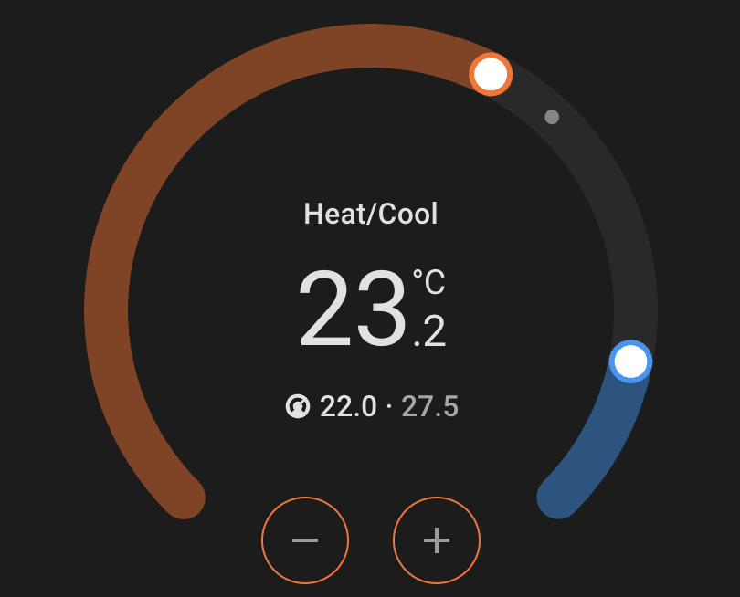

# Two State Thermostat

A Home Assistant Lovelace card for dual-range (heat/cool) climate control with Boost and Maintain operating-state feedback.



## Features

- Dual heating and cooling thermostat range display
- Current control temperature with responsive SVG dial
- Operating state from a dedicated sensor (Off, Idle, Boost/Maintain Heating/Cooling)
- Optional Dry mode from a separate switch entity, with current humidity
- Power button for the virtual climate entity
- Fan button for fan-only mode (circulate air without heating or cooling)
- Boost button with optional countdown from a timer entity; while Boost is active, the countdown extends Boost and a cancel control ends it
- Automatic or manual fan control via Home Assistant helpers
- Theme-aware styling using Home Assistant CSS variables
- Graphical Lovelace card editor

This card is **frontend only**. Thermostat logic, timers, hysteresis, target-gap enforcement across all clients, and fan staging remain in your Home Assistant configuration.

## Installation

### HACS (recommended)

1. Open **HACS**.
2. Open the three-dot menu → **Custom repositories**.
3. Add repository URL:

   `https://github.com/ryanandrewbaker/two-state-thermostat`

4. Select category: **Dashboard**
5. Click **Add**.
6. Open **HACS → Dashboard** (or search for **Two State Thermostat**).
7. Click **Download**.
8. Reload your browser frontend (or clear cache after updates).
9. Add the card to a dashboard (see [Configuration](#configuration)).

HACS normally registers the resource automatically. If the card does not appear, confirm the resource exists under **Settings → Dashboards → Resources**:

```yaml
url: /hacsfiles/two-state-thermostat/two-state-thermostat.js
type: module
```

### Manual installation

1. Download `two-state-thermostat.js` from the [latest release](https://github.com/ryanandrewbaker/two-state-thermostat/releases/latest).
2. Copy it to your Home Assistant `config/www/` directory.
3. Add a Lovelace resource:

```yaml
url: /local/two-state-thermostat.js
type: module
```

4. Reload your browser frontend.

## Configuration

### Minimal example

Select a virtual climate controller entity. The card discovers companion entities from attributes on that entity (or from conservative naming conventions as a fallback):

```yaml
type: custom:two-state-thermostat
entity: climate.family_room_auto_climate
```

### Legacy example

The card continues to accept the previous explicit configuration format:

```yaml
type: custom:two-state-thermostat
climate_entity: climate.family_room_auto_climate
operating_state_entity: sensor.family_room_auto_operating_state
```

### Full example

```yaml
type: custom:two-state-thermostat
name: Family Room
entity: climate.family_room_auto_climate
temperature_entity: sensor.family_room_control_temperature
operating_state_entity: sensor.family_room_auto_operating_state
fan_auto_entity: input_boolean.family_room_fan_automatic
fan_override_entity: input_select.family_room_fan_override
effective_fan_entity: sensor.family_room_effective_fan_mode
recommended_fan_entity: sensor.family_room_automatic_fan_recommendation
boost_script_entity: script.family_room_climate_boost
boost_cancel_script_entity: script.family_room_climate_cancel_boost
boost_active_entity: input_boolean.family_room_climate_boost
boost_timer_entity: timer.family_room_climate_boost
dry_entity: switch.family_room_dry_mode
humidity_entity: sensor.family_room_humidity
power_on_mode: heat_cool
target_step: 0.5
show_countdown: true
show_recommended_fan: true
show_effective_targets: false
```

## Package integration contract

The card does **not** control a physical split system directly. It controls a **virtual climate entity** that your Home Assistant package or automation layer owns. That climate entity is the **anchor** for discovery.

### Recommended configuration

```yaml
type: custom:two-state-thermostat
entity: climate.family_room_auto_climate
```

When your package exposes the attributes below on the virtual climate entity, users only need to select the controller in the card editor. Explicit Lovelace YAML always overrides entity attributes.

### Supported climate attributes

| Attribute                    | Purpose                                                                                  |
| ---------------------------- | ---------------------------------------------------------------------------------------- |
| `two_state_thermostat: true` | Marks this climate entity as compatible with the card (also used for entity suggestions) |
| `temperature_entity`         | External control temperature sensor                                                      |
| `operating_state_entity`     | Operating-state sensor (Off, Idle, Boost/Maintain Heating/Cooling)                       |
| `fan_auto_entity`            | Automatic fan control boolean                                                            |
| `fan_override_entity`        | Manual fan override select                                                               |
| `effective_fan_entity`       | Effective fan mode sensor                                                                |
| `recommended_fan_entity`     | Automatic fan recommendation sensor                                                      |
| `boost_script_entity`        | Boost script (start or extend; package must not replace the original snapshot on re-trigger) |
| `boost_cancel_script_entity` | Boost cancel script (restore snapshot immediately)                                           |
| `boost_active_entity`        | Boost active boolean                                                                         |
| `boost_timer_entity`         | Boost countdown timer                                                                        |
| `dry_entity`                 | Manually controlled Dry/dehumidify switch (not an HVAC mode of the climate entity)           |
| `humidity_entity`            | Current room humidity sensor                                                                 |
| `power_on_mode`              | HVAC mode used when powering on (default: `heat_cool`)                                   |
| `fan_options`                | Fan speed options (list of strings or `{value, label}` objects)                          |
| `target_step`                | Target temperature step (default: `0.5`)                                                 |
| `minimum_target_separation`  | Minimum gap between heating and cooling targets (default: `2`). This is a **minimum**, not a fixed band. |

### Example package attributes

Conceptually, your virtual climate entity might expose:

```yaml
# On climate.family_room_auto_climate
two_state_thermostat: true
temperature_entity: sensor.family_room_control_temperature
operating_state_entity: sensor.family_room_auto_operating_state
fan_auto_entity: input_boolean.family_room_fan_automatic
fan_override_entity: input_select.family_room_fan_override
effective_fan_entity: sensor.family_room_effective_fan_mode
recommended_fan_entity: sensor.family_room_automatic_fan_recommendation
boost_script_entity: script.family_room_climate_boost
boost_cancel_script_entity: script.family_room_climate_cancel_boost
boost_active_entity: input_boolean.family_room_climate_boost
boost_timer_entity: timer.family_room_climate_boost
dry_entity: switch.family_room_dry_mode
humidity_entity: sensor.family_room_humidity
power_on_mode: heat_cool
fan_options:
  - quiet
  - low
  - medium
  - high
target_step: 0.5
minimum_target_separation: 2
```

### Minimum heat/cool gap

`minimum_target_separation` is the smallest allowed difference between the cooling and heating targets. Wider bands are valid and must be left alone.

```text
Heat 19 / Cool 24   ✓  (5°C gap, unchanged)
Heat 20 / Cool 21   ✗  (invalid when the minimum is 2°C)
```

Resolution order:

1. Explicit Lovelace card configuration
2. Attribute on the climate/controller entity
3. Default of `2`

Existing dashboards that set `minimum_target_separation: 1` keep a 1°C gap. Only configurations that rely on the default change to 2°C.

When the user changes one target, that value is authoritative. The opposite target moves only if the minimum gap would otherwise be violated:

```text
Heat 20 / Cool 23, raise Heat to 22  →  Heat 22 / Cool 24
Heat 20 / Cool 23, lower Cool to 21  →  Heat 19 / Cool 21
Heat 18 / Cool 24, raise Heat to 20  →  Heat 20 / Cool 24
```

The Lovelace card enforces this for dial adjustments. The Home Assistant package should enforce the same invariant on every target update (card, another dashboard, automations, Developer Tools) so the gap cannot be bypassed:

```text
cool_target >= heat_target + minimum_target_separation
```

Do not add a second deadband, hysteresis, or Boost-gap setting. `minimum_target_separation` is the single heat/cool band protection.

### Boost

Boost temporarily shifts the currently active heating or cooling target by 2°C, forces the controller-managed fan to High, and restores the previous thermostat and fan settings after 30 minutes or when cancelled.

On the card:

- Idle: Boost pill starts Boost.
- Active: remaining time (click to extend / restart the 30-minute timer) and a cancel control (ends Boost immediately).
- While Boost is active, fan Auto/speed stay locked so they cannot undermine the High fan override. Moving a heat or cool setpoint cancels Boost and applies the new targets.
- The active heat or cool arc also extends 2°C past the live setpoint (dashed, no knob) so the temporary Boost margin is visible: darker orange-red for heating, lighter blue for cooling.

The Home Assistant package owns:

- Boost snapshot (previous heating target, cooling target, fan automatic/manual state, and manual fan selection)
- 30-minute timer
- Restore on expiry or cancel (use the snapshot, do not reverse the Boost mathematically)
- Heating vs cooling direction from controller intent (`maintain_heating` / `boost_heating` → heating Boost; `maintain_cooling` / `boost_cooling` → cooling Boost; idle: last/desired HVAC direction)
- High fan override through controller-managed helpers (never `climate.set_fan_mode` from the card)
- Target-separation enforcement while applying Boost

Re-triggering Boost (clicking remaining time) must keep the original snapshot and the already-boosted targets, force High fan, and restart the timer. Do not compound the 2°C offset.

### Dry mode

Dry is a **separate, manually started dehumidification cycle**. It is not an HVAC mode of the virtual climate entity. Configure a switch and an optional humidity sensor:

```yaml
type: custom:two-state-thermostat
entity: climate.bedroom_auto_climate
dry_entity: switch.bedroom_dry_mode
humidity_entity: sensor.bedroom_humidity
```

Both properties are optional. Cards without `dry_entity` behave exactly as before. Humidity can be shown without Dry, and Dry works without humidity.

While `dry_entity` is `on`:

- The dial uses a yellow **Dry Mode** presentation
- Current temperature and humidity are shown (no humidity target)
- Heat/cool targets, knobs, Boost, and fan staging are hidden
- The Boost control becomes **Switch Mode**, which turns `dry_entity` off and returns to the normal thermostat UI without turning climate on
- **Off** turns off Dry and the climate entity

When Dry is off, Boost, colours, targets, and fan behaviour are unchanged. Humidity, if configured, remains a small secondary reading next to the current temperature.

### Fan only

The fan button on the dial sets the virtual climate entity to HVAC mode `fan_only`. It does **not** call `climate.set_fan_mode`. Fan speed stays on the existing automatic/manual helpers.

The virtual climate entity must accept `fan_only` in `hvac_modes` and run the fan without heating or cooling while that mode is active.

On the card:

- Off or heat/cool: the fan button starts fan only.
- Fan only: the button returns to `power_on_mode` (default `heat_cool`). Power still turns the climate entity off.
- The dial shows **Fan**, current temperature, and humidity. Heat/cool targets, knobs, and Boost are hidden.
- Fan Auto and speed stay available so the circulating fan can still be staged.
- Starting fan only while Boost is active cancels Boost first, so the Boost timer cannot restore heat/cool over the top of fan only.
- Dry mode still takes over the dial. The fan button is hidden until Dry ends.

### Resolution order

Each setting is resolved in this order:

1. Explicit value in the Lovelace card config
2. Attribute on the selected climate entity
3. Safe default (where applicable)
4. Omit optional feature

Discovered values are **not** written back into stored dashboard YAML.

### Naming convention fallback

If attributes are absent, the card can derive companion entities from the controller entity id. For `climate.family_room_auto_climate`, the base `family_room` is used to look up exact entity ids such as `sensor.family_room_auto_operating_state`. Only entities that exist in Home Assistant are used—there is no fuzzy cross-room matching.

### Required and optional entities

**Required:**

- Virtual climate controller (`entity`)
- Operating-state sensor, **or** degraded fallback via `climate.hvac_action` (Off, Idle, Heating, Cooling only; Boost/Maintain arc feedback unavailable)

**Optional:**

- External temperature sensor, fan controls, Boost controls, timer, recommendation sensor
- Dry mode switch and humidity sensor

Missing optional entities omit their UI sections gracefully.

### Sections dashboard layout

New cards default to **half width** (6 of 12 columns) and **8 rows** — two cards per row at a readable width, with enough height for fan controls and Boost.

If you previously set `rows: auto`, replace it with fixed sizing:

```yaml
type: custom:two-state-thermostat
entity: climate.family_room_auto_climate
grid_options:
  columns: 6
  rows: 8
```

Home Assistant keeps saved per-card `grid_options`; updating the card bundle alone does not change existing dashboards. Cards without fan controls may have a little extra vertical space at `rows: 8`; try `rows: 5` or `6` for those.

`getCardSize()` is for legacy Masonry layouts only.

See [CONTRIBUTING.md](CONTRIBUTING.md) for the full entity contract and development guidelines.

## Development

### Prerequisites

- Node.js 22 LTS (or current Node LTS)
- npm

### Setup

```bash
git clone https://github.com/ryanandrewbaker/two-state-thermostat.git
cd two-state-thermostat
npm install
```

### Commands

```bash
npm run dev        # watch build to dist/
npm run build      # production bundle
npm run lint       # ESLint
npm run typecheck  # TypeScript
npm test           # Vitest unit tests
```

### Local testing in Home Assistant

1. Run `npm run build`.
2. Copy or symlink `dist/two-state-thermostat.js` into your HA `config/www/` directory.
3. Register the resource as `/local/two-state-thermostat.js` with `type: module`.
4. Hard-refresh the browser after each rebuild.

## Building

```bash
npm install
npm run build
```

Output: `dist/two-state-thermostat.js`

The built file is committed to the repository so HACS can install directly from the default branch without a GitHub Release.

## Releases

Tagged releases (`v*`) trigger GitHub Actions to build and attach `dist/two-state-thermostat.js` to the release.

```bash
npm run lint && npm run typecheck && npm test && npm run build
git add dist/two-state-thermostat.js
git commit -m "Prepare release v0.1.0"
git tag -f v0.1.0 main
git push origin main
git push origin :refs/tags/v0.1.0
git push origin v0.1.0
```

### GitHub repository settings (recommended)

For HACS validation checks to pass in CI, set these on the GitHub repository **Settings** page:

- **Description:** `Home Assistant Lovelace card for dual-range climate control with Boost and Maintain feedback`
- **Topics:** `home-assistant`, `lovelace`, `custom-card`, `hacs`, `thermostat`, `climate`

These are not required to install via **HACS → Custom repositories**, but they are required for the HACS validation workflow to pass.

## Licence

MIT — see [LICENSE](LICENSE).
